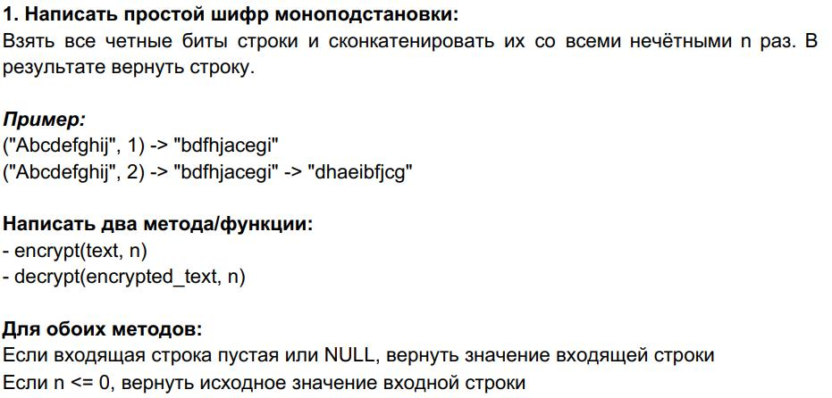
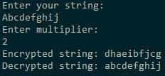
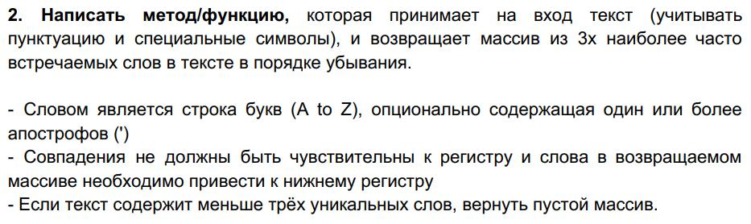
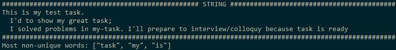

## Доброго времени суток. Благодарю за данное тестовое задание.Выполнять его было интересно.
***
## Features
- :heavy_check_mark: Ruby 2.7
- :heavy_check_mark: Rubocop
***

## Задание 1
### [Online test task1](https://repl.it/@AlexLukyanets/Ruby-test-task#first_task.rb)

## Выполнение

***

## Задание 2
### [Online test task2](https://repl.it/@AlexLukyanets/Ruby-test-task#second_task.rb)

## Выполнение

